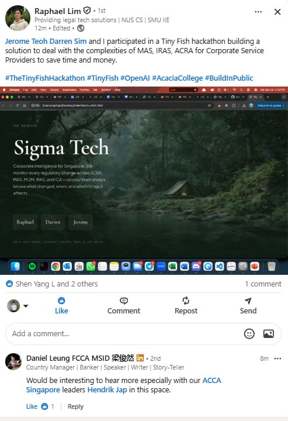
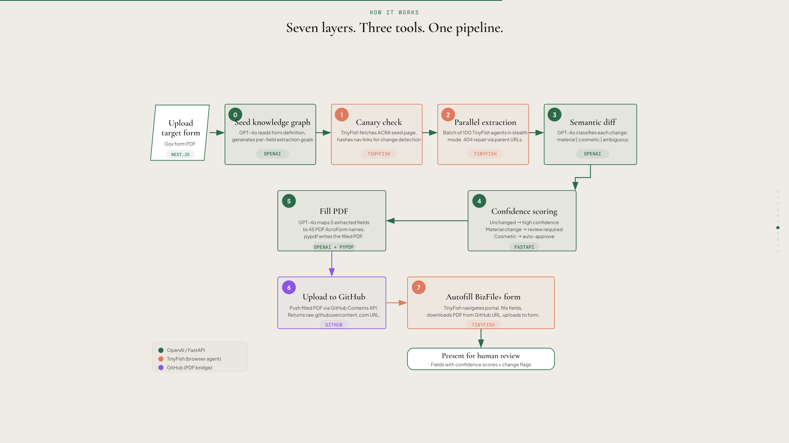

# Sigma Tech — Corporate Intelligence for Singapore

## Industry Validation

> *"Would be interesting to hear more especially with our ACCA Singapore leaders in this space."*
> — **Daniel Leung FCCA MSID**, Country Manager | Banker | Speaker | Writer, ACCA Singapore

## The Problem

Singapore has **1,500–2,000 Corporate Service Providers** managing compliance across 5 government agencies — ACRA, MAS, MOM, IRAS, and ICA. Every day, compliance professionals face:

- **Deeply nested portals** — critical requirements buried 5–7 clicks deep across multiple agency websites
- **100–200+ regulatory changes per year** — with no single source of truth
- **40 minutes of manual research** before every filing or advice session (780 hours/year per firm)
- **Personal liability** under the CSP Act 2024, with fines up to **S$25,000** per failure and **S$27.45M** in MAS enforcement actions (July 2025)
- **No mid-market solution** — enterprise RegTech costs S$100K+/year, built for banks, not CSPs. The only alternative is hiring more staff at S$4,500–5,500/month each.

## What is Sigma Tech?

Our tool is a compliance automation platform that monitors Singapore's government agency websites, detects regulatory changes, and assists with filling up compliance forms for Corporate Service Providers using #TinyFish.

The system connects three tools in a loop: OpenAI reasons about what information to extract and how to interpret changes, TinyFish (a browser automation agent) navigates government portals and fills forms, and a versioned SQLite knowledge graph tracks every change over time with confidence scoring.

When a user uploads a target compliance form, the pipeline reads it, crawls the relevant agency pages, compares what it finds against stored baselines, classifies changes as material or cosmetic, fills the PDF with extracted data, and submits it through the government portal — flagging anything that needs human review. The first target is ACRA's BizFile+ portal for corporate filings, with expansion to MAS, MOM, IRAS, and ICA. It replaces the 40 minutes of manual research a compliance professional does before every filing or advice session.

## System Architecture

## How It Works

## Presentation

- [Pitch Deck (HTML)](sigma-tech.html)

## Built With

TinyFish, OpenAI GPT-4o, FastAPI, Next.js, and SQLite

## Team

Raphael, Darren, Jerome
